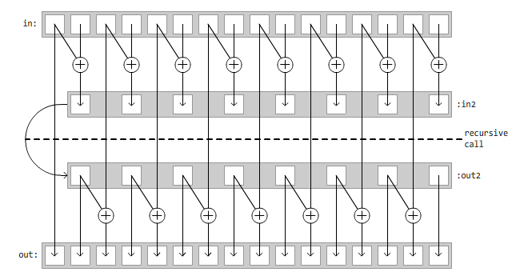

Parallel Prefix Sum
-------------------

###Approaching the problem
The serial algorithm is very difficult to beat in terms of efficiency as it only does `N-1` additions (`N` is the length of the array), which is optimal. Also, memory is read only once and in order, enabling good cache locality and effective prefetching strategies.
The problem does not induce a concurrent activity graph, per se. In the serial algorithm, item `i` depends on item `i-1`. So, in order to obtain a parallelizable algorithm, we have to rearrange the way each element is computed, exploiting the associativity of the sum operator. This means that we have to compute more than `N-1` sums. According to our research, there is no known algorithm that enables good parallelization doing less than `~2*N` additions (asymptotically), which implies that we can't achieve an efficiency greater than `~1/2`.
We evaluated and implemented in C++/FastFlow two different parallel algorithms.

###Iterative algotithm
This algotithm is referred to as "prefixsum slice" in our implementation.
In the first step the input array `in` is divided in `W` slices (`W` is the number of workers), and the prefix sum of every slice is calculated. The result of this step is stored in the output array `out`, which is logically partitioned the same way as `in`.
The second step collects the last item of every slice except for the last slice and places the items in a newly allocated array, `highIn`, of size `W-1`. `highOut` is obtained calculating the prefix sum of `highIn` serially.
The third and last step increases every element of every slice `i`, except for slice `0`, by `highOut[i-1]`:

It is interesting to note that with `W=1` this algorithm reduces to the serial one.
The implementation uses a farm. The unit of computation (`struct task`) represents a slice. Every `task` contains a pointer to the input slice and one to the output slice (with associated length of the slices). In the first step, tasks are emitted and the workers calculate the prefix sum of each slice/task. After this stage, the collector collects and reorders the results. Then the collector itself executes the second step serially. After that, the collector re-emits the tasks through a feedback channel, updating the field `high` to `highOut[i-1]` in the task structs, which is required to calculate step 3. Step 3 is done by the workers. Finally, the collector waits for the results and terminates the farm. We used a feedback channel instead of rolling out two farms, as it was convenient to re-use the same resources for both steps.
The second step is tipically small enough and not worth parallelizing. We couldn't beat the theoretical limit anyway, which says that prefixsum can't be computed with less than `~log2(N)` serial work.

This algorithm does roughly `N + W + N-N/W` additions.
We will use `sumTime` to indicate the time required by each sum operation. The completion time of the two rounds in the farm (considering that the number of elements in the stream is equal to the number of workers) can be estimated as: `2*(W*max(Te, Tc) + Tw + min(Te, Tc))`. `Te` is the time required to emit a task, `Tw` is the time a worker takes to perform a task i.e. `N/W*sumTime`, and `Tc` is the time required to collect a task. In case of too fine grain computations the completion time could be dominated by `W*max(Te, Tc)`. Typically, the number of tasks to be sent between ff_nodes (`2*W`) is very small compared to `N`, so `Te` and `Tc` can be neglected and the completion time can be estimated as `2*Tw = 2*N*sumTime/W`.

###Recursive algorithm
This algorithm is referred to as "prefixsum rec" in our implementation.
The first step is to compute with a parallel-for a pair by pair sum of the input array, obtaining an `N/2` long array, `in2`. Then the prefix sum of `in2` is computed recursively, obtaining `out2`. Finally, `out` is reconstructed (again, with a parallel-for) from `in` and `out2`:

This scheme produces the following concurrent activity graph, where each activity is actually just a sum operation:

The algorithm does roughly `N*2 - log2(N)` additions.
The serial fraction of the work is `~log2(N)/N`, which corresponds to the theoretical lower bound.
Completion time for coarse grain computations can be estimated as `(ceil(N/W) + ceil(N/2/W) + ceil(N/4/W) + ... + ceil(1/W))*sumTime`, which is close to `2*N*sumTime/W`, as the algorithm does roughly `2*N` sums with a parallelism degree of `W`. For finer grain computations, we can expect the `~log2(N)` calls to parallel-for to introduce a cost proportional to `W`, each.

###The library
We provide a very simple C++ library for computing the prefix sum with the algorithms showed. To use it in your program, include the library header you need, add FastFlow to the include path and link with `-lpthread`. Prefixsum rec needs to be compiled with `-std=c++11`. Available headers, located in the "src" folder, are:

- 	`prefixSum.hpp`, which defines:

		template<typename Item>
		void prefixSum(Item in[], Item out[], long len)

- 	`prefixSumRec.hpp`, which defines:

		template<typename Item>
		void prefixSumRec(Item in[], Item out[], Item space[], long len, long workers)

- 	`prefixSumSlice.hpp`, which defines:
	
		template<typename Item>
		void prefixSumSlice(Item in[], Item out[], long len, long workers)

`len` is the length of the array, `workers` is the desired parallelism degree, `Item` can be any user defined type, with the only restriction that the associative operator `+` must be defined on it. Prefixsum rec does not work in-place and needs an extra `len`-long array, `space`, as input. Perfixsum slice tries to align slices to the L1 cache line. To enable the alignment, the following constraints must be satisfied: the start of the array must be aligned; sizeof(Item) must be a multiple or a divisor of the cache line size; the size of the input array must be at least #workers times the cache line size.
The library also comes with programs to help testing the correctness and performance of the algorithms. The programs are defined in `testSerial.cpp`, `testRec.cpp` and `testSlice.cpp`. To build them, run `make all` in the "prefixsum" directory. This will produce `testSerial`, `testRec` and `testSlice` in "prefixsum/bin" folder.
All programs can be invoked from the command line with the following arguments:
`./testRec WORKERS LEN WAIT INIT_MODE`
The tests work on arrays of double precision floating point numbers. `WORKERS` does not affect the serial algorithm. `WAIT` is used to increase the latency of the sum operations, as shown in the following code snippet:

	Double operator +(Double d) {
		volatile long foo = 0;
		for (long i = 0; i < wait; i++) {
			foo += i;
		}
		return Double(x + d.x);
	}

`INIT_MODE` defines how the input array is initialized. Possible values are "ones" (array of all `1.0`), "increasing" (`[0.0, 1.0, 2.0...]`) and "decreasing". An example of invocation is:
`./testSlice 2 1000000 3000 ones`
Which also shows the default values for the arguments, if some are not provided.
Every test program prints the number of milliseconds (wall clock) used by the algorithm to the standard output. Correctness of the algorithms is ensured by verifying that the serial and parallel output are the same.
The "bin" folder also contains shell scripts to facilitate the benchmarking. To use them, you must `cd` into the "bin" folder and type:
`./benchSerial.sh MAX_WORKERS LEN WAIT INIT_MODE`
The scripts execute the corresponding test program with an increasing number of workers, ranging from 1 to `MAX_WORKERS`. Every test is repeated 3 times and the median execution time is reported.

###Performance results
We measured the execution time of the algorithms on a Linux x64 dual socket machine with 24 Xeon cores.

####High latency additions
To benchmark the programs with relatively high latency sum operations, we used the shell scripts discussed above with a 6 million elements long array and 1500 active wait cycles per sum. `best serial` indicates the completion time of the best serial algorithm and `sumTime` has been estimated dividing `best serial` by `N`.

#####Execution time:

Both the algorithms behave impressively close to the theoretical model. As expected, it's not convenient to use parallel algorithms with less than 3 workers.

#####Speedup:

Both algorithms have a speedup very close to `W/2` and scale linearly.

#####Efficiency:

The efficiency of both algorithms is almost constant with `W` in range `[2, 22]` and goes from 0.5 to 0.49. Efficiency of prefixsum rec is halved on `W=25` because the machine only has 24 cores. For prefixsum slice it happens at `W=24`, because additional threads are used by the emitter and collector.

####Low latency additions
For low latency sums we used an input array of 500 millions elements (~4GB of memory) and just 15 active wait cycles on each sum operation.

#####Execution time:

#####Speedup:

Prefixsum slice does a good job in scaling linearly, while prefixsum rec doesn't. The main reasons are: prefixsum slice makes a simple and flat usage of the memory, has a smaller working set and the array is sliced once and for all with alignment to the L1 cache. Prefixsum rec makes a more complicated usage of the memory, has a bigger working set and strategies for avoiding false sharing were more problematic to implement and have been avoided.

#####Efficiency:

For `W` in range `[2, 22]` the efficiency of prefixsum slice goes from 0.54 to 0.51. For prefixsum rec, instead, efficiency drops from 0.55 to 0.4 in the same range.

####Ultra-low latency additions
We did another test further reducing to 5 the number of active wait cycles.

#####Execution time:

#####Speedup:

#####Efficiency:

With these settings even prefixsum slice can't scale properly. According to our measurements, sum operations are so fast that memory transfers take more time than the actual computation. Prefixsum slice has to read-modify-write 4GB of data twice and the best time is 1.4 seconds, 2.85 GB/s, obtained with 17 workers.

###Conclusions
We showed that it's possible to achieve in practice an efficiency close to 1/2 and a good scalability, even for fast sum operations.
In case the sum operations are pure float additions, computation time is determined mostly by memory bandwidth, suggesting that it wouldn't be profitable to offload the work to a GPU, because transferring the data to the device would require an amount of time comparable to computing the results directly in CPU.
Communication between FastFlow nodes was never a bottleneck, as FastFlow is very efficient and the number of messages to be exchanged is very limited and independent from the array length. Communication overheads become visible only for fast sum operations on small arrays, which are instances of the problem not worth computing with a high degree of parallelism.
